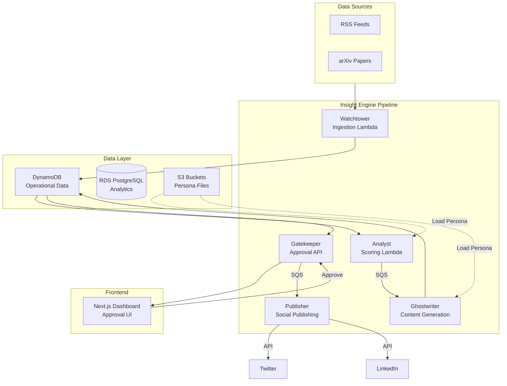

# Insight Engine - AI-Powered Content Pipeline

**Insight Engine** is an event-driven AI content pipeline built on AWS that automatically ingests, analyzes, scores, and generates social media content from RSS feeds and arXiv papers. It features a human-in-the-loop approval workflow and supports publishing to Twitter/X and LinkedIn.

## Overview

Insight Engine transforms how content creators and thought leaders share industry insights by automating the entire content pipeline—from discovering relevant articles to generating platform-specific social posts—all while maintaining human oversight through an intuitive approval dashboard.

## Architecture Overview



## Key Features

### 1. Multi-Source Content Ingestion

- **RSS Feed Monitoring**: Automatically fetches and parses articles from configurable RSS feeds
- **arXiv Integration**: Monitors scientific paper repositories for AI/ML research
- **Deduplication**: Uses Titan Embeddings and DynamoDB GSI to prevent duplicate processing

### 2. AI-Powered Content Analysis

- **Relevance Scoring**: AWS Bedrock (Claude Sonnet) evaluates content against your persona
- **Recency Decay**: Fresh content receives higher priority scores
- **Trend Detection**: Identifies emerging topics within content clusters
- **Hot Take Generation**: Creates engaging takes from high-scoring content

### 3. Persona-Driven Content Generation

- **Configurable Persona**: Define tone, expertise topics, heroes, and enemies
- **Platform Optimization**: Separate generation for Twitter threads and LinkedIn posts
- **Customizable Preferences**: Control thread length, hashtags, emoji usage per platform

Example persona configuration:

```json
{
  "tone": "technical",
  "expertiseTopics": ["artificial intelligence", "machine learning", "LLMs"],
  "heroes": [
    { "name": "Geoffrey Hinton", "description": "Pioneer of deep learning" }
  ],
  "platformPreferences": {
    "twitter": { "maxThreadLength": 8, "hashtags": true, "emoji": false },
    "linkedin": { "hashtags": true, "emoji": false }
  }
}
```

### 4. Human-in-the-Loop Approval Workflow

- **Approval Dashboard**: Next.js interface for reviewing generated content
- **Live Previews**: See exactly how posts will appear on Twitter and LinkedIn
- **Edit Capability**: Modify drafts before approval
- **Bulk Actions**: Approve or reject multiple items at once
- **Audit Trail**: Track all approval decisions

### 5. Social Media Publishing

- **Multi-Platform Support**: Publish to Twitter/X and LinkedIn
- **OAuth 2.0 Integration**: Secure authentication with automatic token refresh
- **User-Connected Accounts**: Each dashboard user connects their own social accounts
- **Retry Logic**: Exponential backoff for failed publishing attempts
- **Status Tracking**: Full visibility into publish queue status

### 6. Enterprise-Grade Infrastructure

- **Terraform IaC**: All infrastructure defined as code
- **Modular Design**: Reusable Terraform modules for each AWS service
- **Cost Controls**: Pause/resume scripts to minimize idle costs
- **Conditional Resources**: VPC and RDS can be toggled on/off
- **Structured Logging**: JSON logs with CloudWatch integration

## Technology Stack

| Component       | Technology                                    |
| --------------- | --------------------------------------------- |
| Runtime         | Node.js 20.x                                  |
| Language        | TypeScript (strict mode)                      |
| Cloud           | AWS (Lambda, DynamoDB, SQS, SNS, Bedrock)     |
| Frontend        | Next.js 14 (App Router)                       |
| Infrastructure  | Terraform                                     |
| Database        | DynamoDB + PostgreSQL 15                      |
| AI/ML           | AWS Bedrock (Claude Sonnet), Titan Embeddings |
| Auth            | AWS Cognito                                   |
| Testing         | Vitest                                        |
| Package Manager | pnpm                                          |

## Quick Start

### Prerequisites

- Node.js 20+
- pnpm 9+
- AWS Account
- Terraform 1.0+

### Installation

```bash
# Clone the repository
git clone <repository-url>
cd insight-engine

# Install dependencies
pnpm install

# Copy environment example
cp .env.example .env
cp infra/terraform.tfvars.example infra/terraform.tfvars
```

### Deployment

```bash
# Deploy infrastructure
cd infra
terraform init
terraform plan -var-file=terraform.tfvars
terraform apply -var-file=terraform.tfvars

# Deploy Lambda functions
cd ..
pnpm build
# Deploy via GitHub Actions or manually
```

## Project Structure

```
insight-engine/
├── apps/
│   └── dashboard/          # Next.js approval dashboard
├── packages/
│   ├── core/              # Shared types, DB clients, utilities
│   ├── watchtower/        # Content ingestion Lambda
│   ├── analyst/           # Scoring & hot take Lambda
│   ├── ghostwriter/       # Content generation Lambda
│   ├── gatekeeper/        # Approval API Lambda
│   └── publisher/         # Social publishing Lambda
├── infra/
│   ├── modules/           # Terraform modules
│   ├── main.tf
│   └── variables.tf
└── scripts/
    ├── pause.sh           # Cost optimization
    └── resume.sh          # Resume operations
```

## Configuration

### Environment Variables

| Variable               | Description                         |
| ---------------------- | ----------------------------------- |
| `AWS_REGION`           | AWS region (default: ap-south-1)    |
| `TABLE_PREFIX`         | DynamoDB table prefix (e.g., dev-)  |
| `PERSONA_FILES_BUCKET` | S3 bucket for persona configuration |

### Persona File

The persona file controls content tone, topics, and generation preferences. Upload to your persona S3 bucket as `persona.json`.

## API Reference

### Gatekeeper API Endpoints

| Endpoint        | Method  | Description                      |
| --------------- | ------- | -------------------------------- |
| `/digest`       | GET     | Fetch pending approval items     |
| `/approve`      | POST    | Approve a draft for publishing   |
| `/reject`       | POST    | Reject a draft                   |
| `/edit-approve` | POST    | Edit and approve modified draft  |
| `/history`      | GET     | Search published content history |
| `/settings`     | GET/PUT | User settings and connections    |
| `/health`       | GET     | Health check                     |

## Security

- **OAuth tokens stored in AWS SSM** as SecureString parameters
- **No secrets in code** - all configuration via environment/SSM
- **JWT authentication** via AWS Cognito
- **Least-privilege IAM** - each Lambda has minimal required permissions

## Cost Optimization

The Insight Engine is designed to minimize AWS costs:

- **Free Tier Friendly**: DynamoDB, SQS, Lambda, and EventBridge have generous free tiers
- **Optional VPC/RDS**: Disabled by default; enable only when needed
- **Pause/Resume Scripts**: Stop EventBridge triggers and RDS when not in use
- **Estimated Phase 1 Cost**: ~$0-3/month with defaults

## Contributing

1. Fork the repository
2. Create a feature branch
3. Make changes following the coding standards
4. Run tests: `pnpm test`
5. Submit a pull request

## License

Private - All rights reserved.

## Related Documentation

- [AGENTS.md](AGENTS.md) - Developer guide and architecture decisions
- [IMPLEMENTATION_PLAN.md](IMPLEMENTATION_PLAN.md) - Full implementation roadmap
